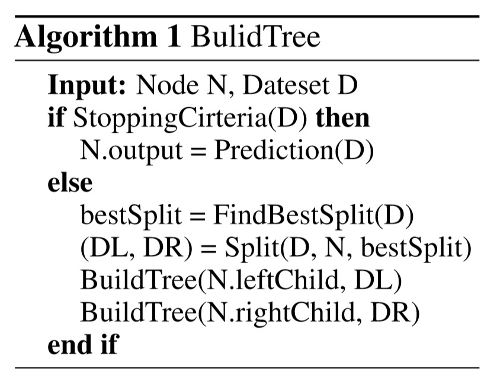

# A Communication-Efficient Parallel Algorithm for Decision Tree

在微软的lightGBM中有使用，这是一种集合弱分类器的提升算法，他的并行决策树的构建使用了这一论文的技术

## 报告流程

1. 决策树串行的简介
2. 困境
3. 并行切入
4. 主要特色

## 简介DT构造过程

DT的作用是输入一个数据，经过一定的判断路径后，则会被归类到一个类上。

DT的构造遵循这样的原理，以西瓜的判断举例，我们知道有一些属性是我们更关心的，比如西瓜敲起来1响不响，知道这一点后很可能我们就能确定西瓜甜不甜了，而其他的属性可能没这个属性重要。所以每个节点的属性选择是有依据的，这个依据用数学的方式来描述，就是用信息量的变化来描述的，这个信息增益可以到信息论里面看详细过程，也就是根据属性的值对应哪个类的概率来计算这个增益。这个概率可以由统计各样本出现次数来近似。更进一步近似，就是使用直方图。这也是常用地方法。

## 决策树技术的困境

决策树的分类和回归预测未知数据的能力可以被应用到非常多的现实应用中。  
decision tree在大数据集下有更好的训练效果（decision中使用概率来计算最佳的分割，这个概率是由出现次数来统计的，所以样本越大，由大数定律越接近真实概率，则越接近真实值）。（*SPRINT: A Scalable Parallel Classifier for Data Mining*[这篇论文采用了attribute-parallel]中提及到，~~证明是在*Experiments on Multistrategy Learning by Meta-Learning*[没有给出详细证明]~~）  
所以虽然DT耗资源少，但是为了用大数据训练，则串行的DT依旧需要耗费很多时间，这是困境

## 引用他人基础

- [12]Decision Trees on Parallel Processors(data-parallel、与其他所有属性的局部直方图进行通信)
- [2]A streaming parallel decision tree algorithm(data-parallel、 exchange quantized histograms between machines )

---
[12] DT算法需要更少的CPU占用，但大数据集下，仍需要很多的CPU使用

---
[2] DT的并行由几种模式（数据摆放方式如下表）：（1）data-parallel水平式并行，将数据横着切开；（2）attribute-parallel垂直式并行，将数据竖着切(每个处理器有不同的attribute)；（3）任务并行，将每个树节点放到不同的处理器上；（4）混合式  

**为何采用水平切分：**

- 数据不存在一个地方
- 或不到达同一个地方
- 或数据量太大，一个processor处理不了

**但是切分后的每个processor仍然可能装不下，怎么办？：**  
使用examples的具有代表性的概要统计数据进行**代替**，不存原本的数据（存histogram，这是一种区间离散化）

**采用的并行：**  
采用的并行方式其实是每个节点都计算histogram，然后主节点汇总所有histogram，则可以计算最佳分割点v。

---

*表格*1  

|属性：|响不响|根蒂长不长|颜色深不深|
|:-:|:-:|:-:|:-:|
|-|响|长|深|
|-|不响|短|浅|

- 数据划分方式

使用了*A Streaming Parallel Decision Tree Algorithm*中一样的划分方式。data-parallel，水平分割数据，每个processor上都有所有的属性，可以生成局部数据的所有属性的直方图（用于统计概率）

## 主要成果：减少通信开销、并且权衡了通信效率与准确性

使用了并行投票树算法PV-Tree

## 如何实现减少通信开销

以往的并行算法只是把直方图的构建分散到各个结点，最后还是在一个主节点上汇集所有直方图后，计算最佳属性和分割点。它并不相信单独一个节点上做出的决策（信息不完整）

但是本文则相反，充分利用了局部的统计信息，然后使用了局部和全局两个阶段的投票过程，这个投票就相当于使用本地的数据选出几个可能是最佳属性的属性。使用这样的两阶段过程，需要传输的就不是所有属性的直方图，减少了通信开销。最后全局汇总的也可能是部分属性的直方图，这将相当于部分决策放到了局部并行来做。

整个PV-Tree的工作流程和一般的决策树差不多，如下图所示，是一个一般的树的构建过程：

图1

PV-tree与一般不同的地方只在FindBestSplit()函数这里

## FindBestSplit主要过程

1、 Local voting.局部投票

On each machine, we select the top-k attributes based on its local data according to the informativeness scores (e.g., risk reduction for regression, and information gain for classification).  
在每个机器上，基于机器上根据**信息增益**的数据，相当于在局部选择最靠前的k个属性（例如回归中的风险降低，分类中的信息增多）。然后只需要将k个属性传给主节点，总共M台机器，通信开销$k \times M$。通信量降低很多

2、 Global voting.全局投票

We determine global top-2k attributes by a majority voting among the local candidates selected in the previous step.That is, we rank the attributes according to the number of local machines who select them,and choose the top 2k attributes from the ranked list.  
我们通过在上一步选出的局部候选属性中得到最多投票的一个排序，来确定被投票最靠前的2k个属性。

3、 Best attribute identification.

We collect the full-grained histograms of the globally top-2k attributes from local machines in order to compute their global distributions. Then we identify the best attribute and its split point according to the informativeness scores calculated from the global distributions.  
我们从局部机器采集细粒度（full-grained）的全局2k个属性的直方图，以计算它们的全局分布，然后我们通过从全局分布计算出的信息增益分数来识别出最佳的属性以及它的划分点。

## 特点

使用了离散的直方图来代替传统的预排序
而是将这些精确的连续的每一个value划分到一系列离散的域中，也就是筒子里。以浮点型数据来举例，一个区间的值会被作为一个筒，然后以这些筒为精度单位的直方图来做。这样一来，数据的表达变得更加简化，减少了内存的使用，而且直方图带来了一定的正则化的效果，能够使我们做出来的模型避免过拟合且具有更好的推广性。

## 为什么每次都要对数据做一次重新统计呢？一次做完不行么
