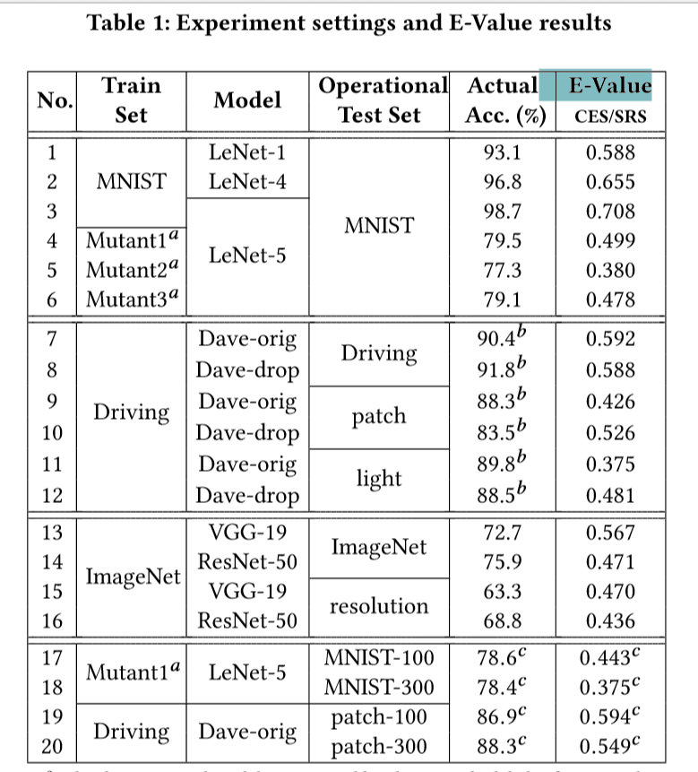

# Boosting Operational DNN Testing Efficiency through Conditioning 通过统计学条件估计法提升深度神经网络的运行时测试效果

## 笔记内容

1. [题目背景、灵感](#题目背景)
2. [解决了什么问题](#31-本文解决了什么问题)
3. [个人对问题的一些理解](#32-个人对问题的一些理解)
4. [主要原理](#4-主要原理)
5. [实验结果](#5-实验)

**主要理论点**：

- 让抽样更符合数据的概率分布

> 这个估计变量，是通过使用测试用例对程序进行测试，用统计的覆盖率估计的。

## 1. 题目背景

DNN，用简单的函数组合成复杂地函数，以表示一个复杂地变换。这个变换挖掘出了数据的深层特征，它使得数据可以被预测拟合和分类。

DNN现在被用在了非常多的领域，所以测试DNN变成了一个很重要的问题，通常都是拿大量的例子对其进行测试，用测试到的pridiction准确率作为DNN的表现优劣。  

传统的**DNN测试方法**是通过人为生成测试样本进行测试，然而为所有操作性的数据打标签的代价是很高的。比如可能需要外科活检手术来判断医学图像是良性还是恶性，在这种情况下打标签的代价是很高的。

在传统软件测试的覆盖测试中，得到了启发。传统测试使用的采样sampling方法是从所有数据中抽取部分，以sample学习整体的某些属性。(这些属性包括平均值、期望、方差等)。这一特性可以被泛化到DNN的测试中。

DNN测试流程

## 2. 本文解决了什么问题

### 2.1 问题列表

1. A formulation of the problem of operational DNN testing as the estimation of performance with a small sample, and a proposal for efficient testing with variance reduction through conditioning,as a generalization of structural coverages.  
本文提出了一个在小样本数据集上，对深度神经网络的运行测试的表现估计的公式化形式。还提出了通过以固定条件初始，来进行方差降低，进而实现高效的测试的方法。这是对结构性测试的泛化。

2. An efficient approach to operational DNN testing that leverages the high dimensional representation learned by the DNN undertesting,and a sampling algorithm realizing the approach based on cross entropy minimization.  
提出了一个借助受测试DNN来利用高维表示信息，以进行DNN运行测试高效方法。还有一个基于交叉熵最小化的用来优化抽样算法的方法。

3. A systematic empirical evaluation.Experiments with LeNet, VGG,and ResNet show that,compared with simple random sampling,this approach requires only about a half of labeled inputs to achieve the same level of precision.  
提出了一个系统化的实验评估标准。在LeNet\VGG\ResNet上的实验显示。与简单的随机抽样相比，这种方法只需要大约一半的标注输入就可以达到同等的精度。

### 2.2 conditioning解释

在统计学中，两个独立变量间X,Z，使用在Z下的h(X|Z)作为平均值估计时的依据，这时的variance会比单独的降低

conditioning是一种去随机化的手段，在以Z为条件的情况下，整体抽样的随机性变低。

$H(X)$函数输出

$Z$已知条件值

$H(X|Z)$条件下函数输出

1. 全方差法则 $Var[H(X)]=E[Var[H(X|Z)]] + Var[E[H(X|Z)]]$
   - 这一法则利用了$Var$对于常数为0的特点，使得**前项**中依赖于$Z$的$H(X|Z)$值为0；同时，借助$E$对于常数保持不变的特点，使得后项依赖于$Z$的$H(X|Z)$保持原值。
   - 借用这一原理，当$H(X|Z)$完全依赖于Z时，$Var[H(X)]=Var[E[H(X|Z)]]$
   - 所以可得，使用conditioning方法时$E(H(X))=E(E(H(X|Z))$
   - 在以方差作为某些度量标准时，$E(H(X|Z))$可以代替$H(X)$
2. 并且，当使用抽样时，能保证独立随机抽样，$Var(\hat{\theta})=Var(抽样数据的平均值)=\frac{1}{n}Var(H(X))$，即用抽样数据对理想平均值的方差，相较于真实数据对理想平均值的方差，反而更小。
   - 而正好因为$E(H(X|Z))$可以通过对$Z$进行抽样来计算出近似值，则这个近似，也能使方差变小

经过如上两个步骤，方差变小了

### 2.3 传统的测试方法

structural coverages [$^{[1]}$](#参考文献)结构性覆盖测试

> 1、这一测试主要是要寻找代码结构中没有被测试用例测试到的地方。  
> 2、找到能够去覆盖未测试的部分的测试用例  
> 3、确定一种量化的对代码覆盖性好坏的度量标准，是一种度量软件质量的非直接的方式  
> 4、丢弃无用的不能提高覆盖的测试用例  

- 最简单的结构覆盖测试——语句覆盖（statement coverage），被称为最弱的覆盖，只考虑可执行的语句，不考虑分支结构。即使覆盖率100%，也不容易发现bug，一个测试用例可以使语句覆盖100%但是，但是可能却没有使用出错用例。
- 分支覆盖/判断覆盖（branch coverage），确保代码中的每个分支路径都被执行了，这样可以避免没有测试到某个分支，而导致了程序的不正常行为没有被发现。

结构性覆盖的主要实施问题在于：

1. 如何找到不执行的代码组件；  
2. 如何制造能够覆盖更多未覆盖的组件的测试用例;  

### 2.4 测试覆盖

测试覆盖代表着代码在使用测试用例测试时，能够有多少的代码被测试到。代码测试覆盖高的程序会比低的少一些未检测到的bug，因为覆盖低的在未覆盖的部分很容易出现漏测。

### 2.5 DNN测试中应把握的要点

1. 保持统计性：不需完全的正确率，这样可以防止过拟合
2. DNN是黑盒，这样的黑盒需要用整体的方法来看待
3. 运行时性质，要使测试满足真正的运行时状态，让测试不会出现与现实的偏差

## 3. 个人对一些问题的一些理解

### 3.1 如何确定用样本估计的覆盖率足够接近真实

应该只能越接近越好

### 3.2 Estimated Operational Accuracy

运行测试已训练好的DNN的表现，其Estimated Operational Accuracy是指DNN对有限的样本进行预测，以统计学，将{准确/总数}的概率作为对理想真实概率的近似概率的估计。

### 3.3 结构性测试与DNN运行测试

**DNN的测试**实际上和**程序的结构性测试**十分相似，程序的结构性测试讲求用测试用例确认程序能够在结构上被覆盖得多完整，以达到间接评估程序的质量的目的。DNN为了测试，也是需要让用例测试到DNN的每一个部分，这样评估整个网络结构被覆盖的程度，达到评估网络质量以及正确性的目的。

在结构化测试中，为了能尽可能使用小测试样本就达到较为完整的覆盖测试，构建一个蒙特卡洛问题[$^{[2]}$](#参考文献)，以方差缩减的方式来在同样大小的样本下达到更好的测试效果。这个理念也可以被泛化到DNN的测试领域。

## 4. 主要原理

### 4.1 程序覆盖测试引入减少方差的采样方式

将减少方差的采样方式引入结构性覆盖测试的测试用测的采样：

- conditioning的采样方法，其方差更加的小。这其中为了使方差变小，从理论上有两个要点：1、识别出足够能更好决定X的条件变量Z（同质性）；2、选择对于Z更加有代表性的采样（多样性）
- 在软件测试中，为了找到合适的测试用例，同样有 1、同质性；2、多样性；两种方法来使测试用例更加优质。

所以把conditioning的方式引入了结构性覆盖测试的估计过程

### 4.2 DDN引入conditioning

- 引入是有困难的
    1. 黑盒性，使得没有能够预先指示出测试数据应具有的哪些同质性（程序代码中的分支则可以显式告知）
    2. 想找到能够指示模型准确率的条件变量Z，需要解决高维表示这个问题，这很难用小数据样本在没有巨大不确定性下表示Z。

如下所示，是几种被使用的采样方法：

1. SRS (Simple Random Sampling) estimator
   - 随机有重复的抽样
2. CSS (Confidence-based Stratified Sampling) estimator
   - 使用可信值$c(x)$作为与模型输出结果有着极大的相关性的随机变量，随后使用conditioning。这种方法的问题在于$c(x)$的选取如果是从训练得不好得模型上训练出来的，那么效果会极差。
3. CES (Cross Entropy-baed Sampling) estimator
   - 直接使用模型得最后一层得输出作为随机变量，这里用了迁移学习中的一些经验，这样通常得到的变量相关性很高。

## 5. 实验

如下图所示，本文设计了20个实验

- 实验的结果主要说明
    1. CSS在训练集和测试集良好的情况下，是非常优秀的方法
    2. CES可以在训练集和测试集具有较大差异时，仍然保持良好的效果

## 参考文献

[1]Baluda M, Braione P, Denaro G, et al. Structural coverage of feasible code[C]//Proceedings of the 5th Workshop on Automation of Software Test. ACM, 2010: 59-66.  
[2] Art B. Owen. 2013. Monte Carlo theory, methods and examples. https://statweb.stanford.edu/owen/mc/.
